深度生成对抗网络
===
本节实现了以下六种数据集

# 1.Mnist$(28 \times 28)$
| 001 | 010 | 050 | 100 |
| --- | --- | --- | --- |
| 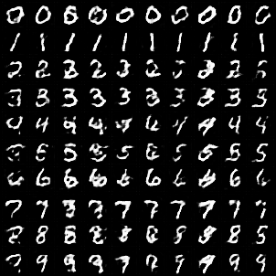 | 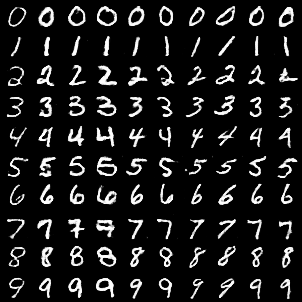 | 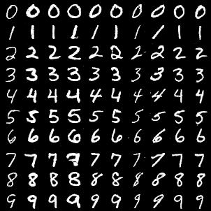 | 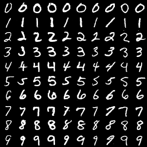 |

# 2.FashionMnist$(28 \times 28)$
| 001 | 010 | 050 | 100 |
| --- | --- | --- | --- |
| 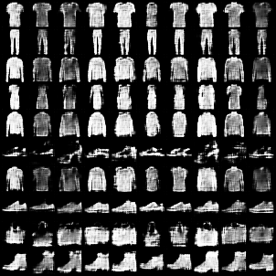 | 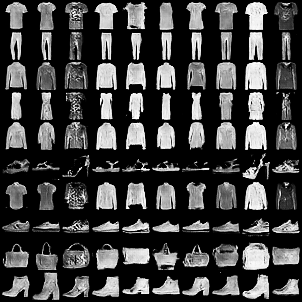 | 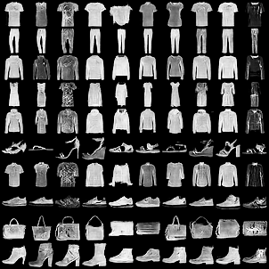 | 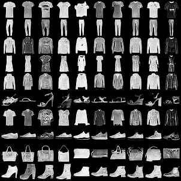 |

# 3.Cifar10$(32 \times 32)$
| 001 | 010 | 050 | 100 |
| --- | --- | --- | --- |
| 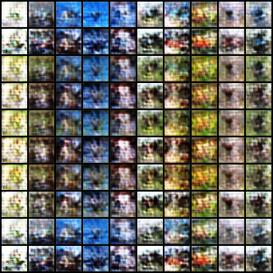 | 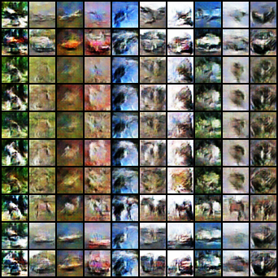 | 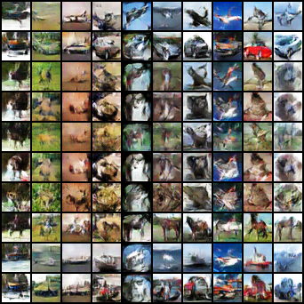 | 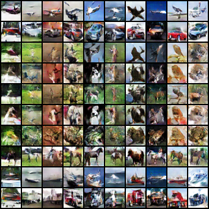 |

# 4.Face$(64 \times 64)$
| 001 | 010 | 050 | 100 |
| --- | --- | --- | --- |
|  |  |  |  |

# 5.AnimateFace$(96 \times 96)$
| 001 | 010 | 050 | 100 |
| --- | --- | --- | --- |
|  |  |  |  |

# 6.Cat$(128 \times 128)$
| 001 | 010 | 050 | 100 |
| --- | --- | --- | --- |
|  |  |  |  |
